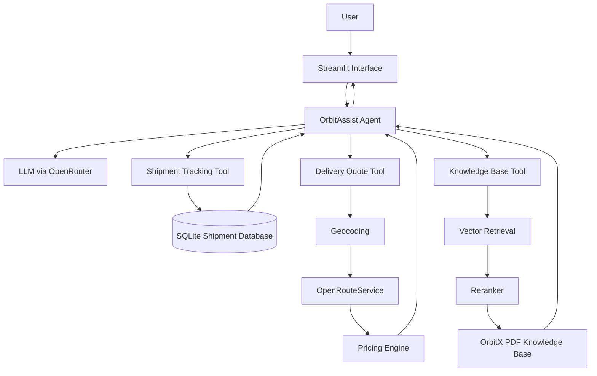

# OrbitX Logistics — AI Customer Support Platform

OrbitX Logistics is a fictional logistics company created for this project.

The project is an AI-powered customer support platform that combines conversational AI, shipment tracking, route-based delivery pricing, and retrieval-augmented generation in one Streamlit application.

The goal was to build a customer support assistant that does more than answer questions. OrbitAssist can understand a user's request, decide which tool is needed, retrieve company information, query shipment data, and calculate delivery estimates using real routing data.

## Live Demo

Live application:

`Coming soon`

## Key Features

### OrbitAssist AI

A conversational AI assistant capable of handling different logistics support requests through natural language.

It can:

- guide users through shipment tracking
- calculate delivery estimates
- answer questions about company policies
- maintain conversation context
- decide when an external tool is required

### Shipment Tracking

Shipment information is stored in a SQLite database.

Users can enter an OrbitX tracking ID and view:

- shipment status
- origin and destination
- service type
- expected delivery date
- latest recorded location
- delivery attempts
- latest shipment activity
- shipment progress timeline
- route visualization

The tracking map distinguishes between the completed and remaining portions of the shipment journey.

### Route-Based Delivery Quotes

Delivery estimates use live routing data instead of fixed city-to-city distances.

The quote engine considers:

- origin
- destination
- road distance
- estimated driving time
- shipment weight
- delivery service
- insurance
- declared shipment value

Supported services include:

- Standard
- Express
- Same-Day

### Policy Center

OrbitX company information is stored in a PDF knowledge base.

The application uses a Retrieval-Augmented Generation pipeline to answer policy and service questions using company documentation instead of relying only on the language model.

Users can search topics such as:

- delivery services
- shipping rates
- packaging requirements
- restricted items
- cash on delivery
- insurance
- shipment tracking
- failed deliveries
- returns
- lost shipments
- damaged shipments
- international shipping

## System Architecture



## RAG Pipeline

The policy assistant follows a Retrieval-Augmented Generation workflow:

```text
OrbitX PDF
    ↓
Document loading
    ↓
Text chunking
    ↓
Embeddings
    ↓
Vector store
    ↓
Semantic retrieval
    ↓
Reranking
    ↓
Relevant context
    ↓
LLM response
```

The embedding model used by the project is:

```text
BAAI/bge-small-en-v1.5
```

Retrieved documents are reranked before the final context is passed to the language model.

## Agent Tool Flow

OrbitAssist decides which capability should handle each request.

```text
User message
     ↓
OrbitAssist
     ↓
Intent / tool decision
     ↓
 ┌───────────────┬──────────────────┬─────────────────┐
 │               │                  │                 │
Tracking      Delivery Quote      Policy Search
 │               │                  │
SQLite       Routing API          RAG Pipeline
 │               │                  │
 └───────────────┴──────────────────┴─────────────────┘
                     ↓
                Final response
```

This allows the chatbot to support multi-turn conversations instead of requiring users to interact with each feature separately.

## Technology Stack

### Frontend

- Streamlit
- HTML
- CSS
- PyDeck

### AI & LLM

- LangChain
- OpenRouter
- Retrieval-Augmented Generation
- Tool-calling agent

### Retrieval

- Hugging Face embeddings
- BAAI/bge-small-en-v1.5
- Semantic vector retrieval
- Document reranking

### Data

- SQLite
- PDF knowledge base
- Local vector store

### External API

- OpenRouteService

OpenRouteService is used for:

- geocoding
- road-distance calculation
- driving-time estimation
- route geometry

## Project Structure

```text
smart-customer-support-bot/
│
├── app.py
│
├── README.md
│
├── requirements.txt
│
├── .gitignore
│
├── .env
│
├── data/
│   ├── orbitx_shipments.db
│   ├── vectorstore/
│   └── orbitx_company_information.pdf
│
└── src/
    ├── __init__.py
    ├── agent.py
    ├── config.py
    ├── ingestion.py
    ├── init_database.py
    ├── llm.py
    ├── reranker.py
    ├── retrieval.py
    └── tools.py
```

## Core Components

### `agent.py`

Contains the OrbitAssist agent and conversation workflow.

The agent receives the user's request and determines whether it should respond directly or use one of the available tools.

### `tools.py`

Contains the tools available to OrbitAssist.

The current tools are:

```text
search_knowledge_base
track_shipment
estimate_delivery_quote
```

### `retrieval.py`

Retrieves relevant chunks from the OrbitX vector knowledge base.

### `reranker.py`

Reranks retrieved documents so that the strongest context is prioritized before generation.

### `ingestion.py`

Loads and processes the OrbitX company PDF and creates the vector knowledge base.

### `init_database.py`

Creates the fictional OrbitX shipment database used by the tracking system.

### `app.py`

Contains the Streamlit user interface including:

- AI Assistant
- Shipment Tracking
- Delivery Quote
- Policy Center

## Demo Tracking IDs

The project contains fictional shipment records that can be used to test the tracking system.

```text
OX10451
OX10452
OX10453
OX10454
OX10455
```

For example:

```text
OX10452
```

represents an Express shipment currently out for delivery.

## Local Setup

Clone the repository:

```bash
git clone https://github.com/YOUR_USERNAME/orbitx-logistics-ai-assistant.git
```

Move into the project:

```bash
cd orbitx-logistics-ai-assistant
```

Create a virtual environment:

```bash
python -m venv .venv
```

Activate it on Windows:

```bash
.venv\Scripts\activate
```

Install dependencies:

```bash
pip install -r requirements.txt
```

## Environment Variables

Create a `.env` file in the root directory.

```env
OPENROUTER_API_KEY=your_openrouter_api_key
LLM_MODEL=your_model_name
ORS_API_KEY=your_openrouteservice_api_key
```

The `.env` file must not be committed to GitHub.

## Initialize the Shipment Database

Run:

```bash
python -m src.init_database
```

## Build the Knowledge Base

If the vector store has not already been created, run:

```bash
python -m src.ingestion
```

## Run the Application

```bash
streamlit run app.py
```

The application will open in your browser.

## Example User Flows

### Shipment Tracking

```text
User:
I want to track my shipment.

OrbitAssist:
Please provide your tracking ID.

User:
OX10452
```

OrbitAssist retrieves the shipment from SQLite and returns the latest tracking information.

### Delivery Estimate

```text
User:
I need a delivery estimate.
```

OrbitAssist can collect the required delivery information and use the route-based pricing tool.

### Policy Question

```text
User:
What happens if my shipment is damaged?
```

OrbitAssist searches the OrbitX knowledge base and answers using retrieved policy information.

## Design Approach

The interface was designed to feel like a real logistics customer portal rather than a basic chatbot demo.

The application includes:

- custom company branding
- conversational chat UI
- distinct customer and AI messages
- AI generation state
- shipment journey visualization
- interactive route maps
- structured quote summaries
- policy search interface
- responsive UI

## Project Purpose

This project demonstrates how several AI and software engineering concepts can be combined into one practical application:

- LLM applications
- AI agents
- tool calling
- RAG
- embeddings
- document retrieval
- reranking
- API integration
- database integration
- conversational memory
- Streamlit application development
- UI design

## Disclaimer

OrbitX Logistics is a fictional company created for demonstration and portfolio purposes.

Shipment records, policies, prices, and operational information included in this repository are fictional and should not be interpreted as information from a real logistics provider.

## Author

Sama

AI / Data Science Portfolio Project