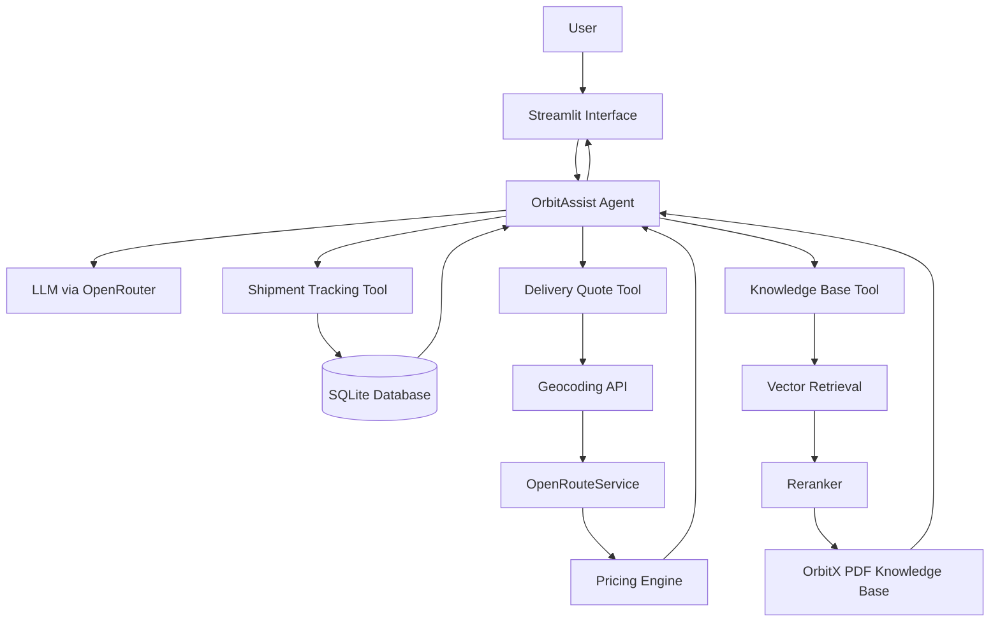

# OrbitX Logistics — AI Customer Support Platform

[](https://orbitx-logistics-ai-assistant-sm.streamlit.app/)
[](https://www.python.org/)
[](https://www.langchain.com/)

OrbitX Logistics is a fictional logistics company created for this project.

This project is an AI-powered customer support platform that combines conversational AI, tool calling, retrieval-augmented generation, shipment tracking, SQLite, and live route-based delivery pricing in one Streamlit application.

Unlike a basic chatbot, OrbitAssist can understand the user's request, maintain conversation context, choose the appropriate tool, retrieve company information, query shipment data, and calculate delivery estimates using live routing data.

## Live Demo

Try the deployed application:

https://orbitx-logistics-ai-assistant-sm.streamlit.app/

GitHub repository:

https://github.com/sama-elmoataz/orbitx-logistics-ai-assistant

---

## Project Objectives

The project was designed to demonstrate how a customer support AI agent can combine:

- Retrieval-Augmented Generation
- tool calling
- multi-turn conversation
- conversational memory
- database access
- external API integration
- routing and geocoding
- shipment tracking
- document retrieval
- reranking
- custom user interface design

The result is a support assistant that can decide how to handle different customer requests rather than relying on a single static response pipeline.

---

# Key Features

## 1. OrbitAssist AI

OrbitAssist is the conversational layer of the application.

Users can communicate naturally instead of selecting a separate technical workflow for every task.

OrbitAssist can:

- understand customer requests
- maintain context across multiple messages
- ask for missing information
- decide when a tool is required
- track shipments
- calculate delivery estimates
- answer company policy questions
- combine tool results into customer-friendly responses

Example:

```text
User:
I need help tracking a shipment.

OrbitAssist:
Sure. Please send me your tracking ID.

User:
OX10452

OrbitAssist:
Your shipment OX10452 is currently out for delivery.
```

The assistant understands that `OX10452` belongs to the previous tracking request because conversation context is preserved.

---

## 2. Shipment Tracking

Shipment information is stored in a SQLite database.

Customers can enter a tracking ID and retrieve structured shipment information including:

- tracking ID
- current shipment status
- origin
- destination
- service type
- expected delivery date
- latest recorded location
- number of delivery attempts
- latest shipment activity

The tracking interface also includes:

- shipment progress timeline
- route visualization
- origin marker
- latest scan marker
- destination marker
- travelled route
- remaining route

The latest shipment location is retrieved from stored coordinates rather than geocoding fictional hub names.

This avoids inaccurate map positioning and makes the shipment tracking logic more realistic.

---

## 3. Route-Based Delivery Quote

The delivery quote tool calculates prices using actual road-distance data.

Instead of relying on hard-coded city-to-city distances, the application:

1. receives the origin and destination
2. geocodes both locations
3. retrieves the driving route
4. calculates the route distance
5. estimates driving time
6. applies OrbitX pricing rules
7. returns a structured quote

The pricing engine considers:

- origin
- destination
- shipment weight
- road distance
- service type
- insurance
- declared shipment value

Supported services:

```text
Standard
Express
Same-Day
```

Same-Day delivery also includes route eligibility validation.

---

## 4. Policy Center

OrbitX company policies are stored inside a fictional company knowledge-base PDF.

The Policy Center allows users to search company information through a Retrieval-Augmented Generation pipeline.

Supported topics include:

- delivery services
- shipping rates
- packaging requirements
- restricted items
- cash on delivery
- insurance
- tracking statuses
- failed deliveries
- returns
- lost shipments
- damaged shipments
- international shipping

The assistant is instructed to answer using retrieved OrbitX documentation rather than inventing missing policy information.

---

# System Architecture



---

# Agent Workflow

OrbitAssist determines which capability is needed based on the conversation.

```text
User Message
     ↓
OrbitAssist Agent
     ↓
Intent / Tool Decision
     ↓
 ┌────────────────┬────────────────────┬──────────────────┐
 │                │                    │                  │
Shipment       Delivery Quote       Policy Search
Tracking            │                    │
 │                  │                    │
SQLite          Routing API          RAG Pipeline
 │                  │                    │
 └──────────────────┴────────────────────┴──────────────────┘
                         ↓
                  Final AI Response
```

The user does not need to manually choose the technical tool from the chat.

OrbitAssist performs the decision internally.

---

# Agent Tools

The agent currently has access to three tools.

| Tool | Purpose | Data Source |
|---|---|---|
| `track_shipment` | Retrieve shipment details using a tracking ID | SQLite |
| `estimate_delivery_quote` | Calculate route-based delivery pricing | OpenRouteService |
| `search_knowledge_base` | Search OrbitX company documentation | Vector database + PDF |

This gives the project three different tool categories:

- database tool
- external API tool
- RAG retrieval tool

---

# Conversation Memory

OrbitAssist supports multi-turn conversations.

This means the user does not need to repeat the entire request in every message.

Example:

```text
User:
I want to track my package.

OrbitAssist:
Please send me the tracking ID.

User:
OX10452
```

The second message is interpreted within the context of the previous request.

This allows the chatbot to behave more naturally than a single-turn question-answering system.

---

# RAG Pipeline

The Policy Center uses Retrieval-Augmented Generation.

```text
OrbitX PDF
    ↓
Document Loader
    ↓
Text Splitting
    ↓
Chunks
    ↓
Embeddings
    ↓
Vector Store
    ↓
Semantic Retrieval
    ↓
Reranking
    ↓
Relevant Context
    ↓
LLM
    ↓
Grounded Answer
```

The embedding model used by the project is:

```text
BAAI/bge-small-en-v1.5
```

Instead of immediately sending the first retrieved chunks to the LLM, retrieved documents are reranked so that the strongest results receive higher priority.

This improves the quality of the context sent to the final generation step.

---

# RAG Query Flow

A policy question follows this process:

```text
User:
What happens if my shipment is damaged?

        ↓

Semantic retrieval

        ↓

Relevant OrbitX policy chunks

        ↓

Document reranking

        ↓

Highest relevance chunks

        ↓

LLM receives:
Question + retrieved context

        ↓

Grounded customer response
```

---

# Shipment Tracking Architecture

Tracking uses structured database information rather than asking the LLM to invent shipment information.

```text
Tracking ID
    ↓
SQLite Query
    ↓
Shipment Record
    ↓
Status
Origin
Destination
Latest Location
Expected Delivery
Activity
Coordinates
    ↓
Streamlit Tracking UI
```

The shipment coordinates stored in the database are also used for the tracking map.

---

# Delivery Quote Architecture

```text
Origin + Destination
        ↓
Geocoding
        ↓
Coordinates
        ↓
OpenRouteService
        ↓
Road Distance
Driving Time
Route Geometry
        ↓
OrbitX Pricing Rules
        ↓
Estimated Quote
```

This allows the project to demonstrate a real external API integration instead of returning a fixed fictional price.

---

# Error Handling

The application includes handling for common support and system errors.

Examples include:

### Unknown Tracking ID

If the shipment does not exist:

```text
No shipment was found with tracking ID XXXXX.
```

### Invalid Location

If the quote tool cannot geocode a location, the customer receives an error instead of an incorrect estimate.

### Routing API Failure

If the external routing service becomes unavailable, the tool returns a controlled error message.

### Invalid Shipment Weight

Weights outside the supported rules are rejected before pricing is calculated.

### Missing Insurance Value

If insurance is selected without a valid declared shipment value, the quote is not calculated.

### RAG Grounding

The policy assistant is instructed not to invent information that is missing from the retrieved OrbitX documentation.

---

# Demo Conversation

The following flow demonstrates multi-turn conversation and tool use.

## Shipment Tracking

```text
User:
I need help tracking a shipment.

OrbitAssist:
Sure. Please provide your OrbitX tracking ID.

User:
OX10452

OrbitAssist:
Shipment OX10452 is currently out for delivery.

Service: Express
Route: New Cairo, Cairo → Heliopolis, Cairo
Current location: Heliopolis Delivery Station
Expected delivery: 2026-09-19

The courier route has been assigned for final delivery.
```

---

## Delivery Quote

```text
User:
I need a delivery estimate.

OrbitAssist:
Sure. Please provide the origin, destination,
package weight and preferred delivery service.

User:
New Cairo to Alexandria, 5 kg, Express.

OrbitAssist:
Uses the delivery quote tool.

The tool:
- geocodes both locations
- calculates the road route
- retrieves distance and driving time
- applies Express pricing
- returns the estimated price
```

---

## Policy Question

```text
User:
What happens if a delivery attempt fails?

OrbitAssist:
Searches the OrbitX knowledge base.

The answer is generated using retrieved
company policy context rather than general
LLM knowledge.
```

---

# Testing Scenarios

The application was tested across different tool and conversation scenarios.

| Test | Expected Behavior |
|---|---|
| Valid tracking ID | Shipment details returned |
| Invalid tracking ID | Controlled not-found response |
| Follow-up tracking ID | Context from previous message maintained |
| Valid delivery locations | Routing and quote calculated |
| Invalid delivery location | Geocoding error returned |
| Same-Day long-distance route | Service rejected when not eligible |
| Policy question | Relevant knowledge-base content retrieved |
| Unsupported policy information | Assistant avoids inventing company information |
| Multiple conversation turns | Conversation context maintained |
| External API error | Controlled error message returned |

---

# Technology Stack

## Frontend

- Streamlit
- HTML
- CSS
- PyDeck

## AI

- LangChain
- OpenRouter
- LLM tool calling
- conversational agent

## Retrieval

- Hugging Face embeddings
- BAAI/bge-small-en-v1.5
- semantic search
- document reranking
- vector store

## Data

- SQLite
- PDF knowledge base
- local vector database

## External API

- OpenRouteService

OpenRouteService is used for:

- geocoding
- road-distance calculation
- driving-time estimation
- route geometry

---

# Project Structure

```text
orbitx-logistics-ai-assistant/
│
├── app.py
├── README.md
├── requirements.txt
├── .gitignore
│
├── data/
│   ├── orbitx_shipments.db
│   ├── orbitx_company_information.pdf
│   └── vectorstore/
│
└── src/
    ├── __init__.py
    ├── agent.py
    ├── config.py
    ├── ingestion.py
    ├── init_database.py
    ├── llm.py
    ├── reranker.py
    ├── retrieval.py
    └── tools.py
```

---

# Main Components

## `app.py`

Contains the complete Streamlit interface.

The application contains four main areas:

```text
AI Assistant
Track Shipment
Get a Quote
Policy Center
```

The UI also includes:

- custom OrbitX branding
- conversational message bubbles
- AI response generation state
- quick actions
- shipment timeline
- route visualization
- quote summary
- policy search

---

## `agent.py`

Contains the OrbitAssist conversational agent.

The agent:

- receives user messages
- keeps conversation history
- determines whether a tool is required
- executes tools
- processes tool output
- generates the final customer response

---

## `tools.py`

Contains the external capabilities available to the agent:

```python
search_knowledge_base
track_shipment
estimate_delivery_quote
```

---

## `retrieval.py`

Retrieves semantically relevant chunks from the OrbitX vector store.

---

## `reranker.py`

Reranks retrieved documents before they are provided to the final generation step.

---

## `ingestion.py`

Processes the OrbitX company PDF.

The ingestion pipeline creates the knowledge base used by the RAG system.

---

## `init_database.py`

Creates the fictional OrbitX shipment database and demo records.

---

# Demo Tracking IDs

The SQLite database contains fictional tracking records for testing.

```text
OX10451
OX10452
OX10453
OX10454
OX10455
```

A recommended demo shipment is:

```text
OX10452
```

This shipment is currently:

```text
Out for Delivery
```

---

# Local Installation

Clone the repository:

```bash
git clone https://github.com/sama-elmoataz/orbitx-logistics-ai-assistant.git
```

Enter the project directory:

```bash
cd orbitx-logistics-ai-assistant
```

Create a virtual environment:

```bash
python -m venv .venv
```

Activate it on Windows:

```bash
.venv\Scripts\activate
```

Install the required packages:

```bash
pip install -r requirements.txt
```

---

# Environment Variables

Create a `.env` file in the project root.

```env
OPENROUTER_API_KEY=your_openrouter_api_key
LLM_MODEL=your_model_name
ORS_API_KEY=your_openrouteservice_api_key
```

The `.env` file contains private API credentials and must not be committed to GitHub.

---

# Initialize Shipment Database

Run:

```bash
python -m src.init_database
```

This creates the SQLite shipment database used by the tracking tool.

---

# Build the Knowledge Base

Run:

```bash
python -m src.ingestion
```

This processes the OrbitX company information PDF and creates the vector store used by the RAG pipeline.

---

# Run Locally

Start the Streamlit application:

```bash
streamlit run app.py
```

Then open the local Streamlit URL in your browser.

---

# Deployment

The application is deployed using Streamlit Community Cloud.

Live version:

https://orbitx-logistics-ai-assistant-sm.streamlit.app/

API credentials are configured using Streamlit secrets and are not stored in the public GitHub repository.

---

# UI Design

The interface was intentionally designed to resemble a real customer-facing logistics portal rather than a basic AI demonstration.

The design includes:

- custom OrbitX Logistics branding
- minimal logistics-focused visual identity
- separate user and AI chat styles
- animated AI generation state
- general quick actions
- conversational support flow
- interactive shipment map
- delivery progress visualization
- structured delivery quote cards
- searchable policy center

---

# What This Project Demonstrates

This project combines several AI and software engineering concepts within one end-to-end application:

```text
LLM Applications
AI Agents
Tool Calling
Conversational Memory
Multi-Turn Chat
Retrieval-Augmented Generation
Embeddings
Vector Search
Reranking
SQLite
External APIs
Geocoding
Route Calculation
Data Validation
Error Handling
Streamlit
Custom UI Design
Cloud Deployment
```

---

# Future Improvements

Potential future extensions include:

- real courier GPS tracking
- user authentication
- customer accounts
- shipment creation
- delivery notifications
- support ticket escalation
- human-agent handoff
- persistent chat history
- production shipment APIs
- customer feedback analytics
- multilingual Arabic and English support

---

# Disclaimer

OrbitX Logistics is a fictional company created exclusively for educational, demonstration, and portfolio purposes.

All company policies, shipment records, prices, locations, operational information, and customer scenarios included in this project are fictional.

They should not be interpreted as information from a real logistics provider.

---

# Author

**Sama Elmoataz**

GitHub:  
https://github.com/sama-elmoataz

Live Project:  
https://orbitx-logistics-ai-assistant-sm.streamlit.app/